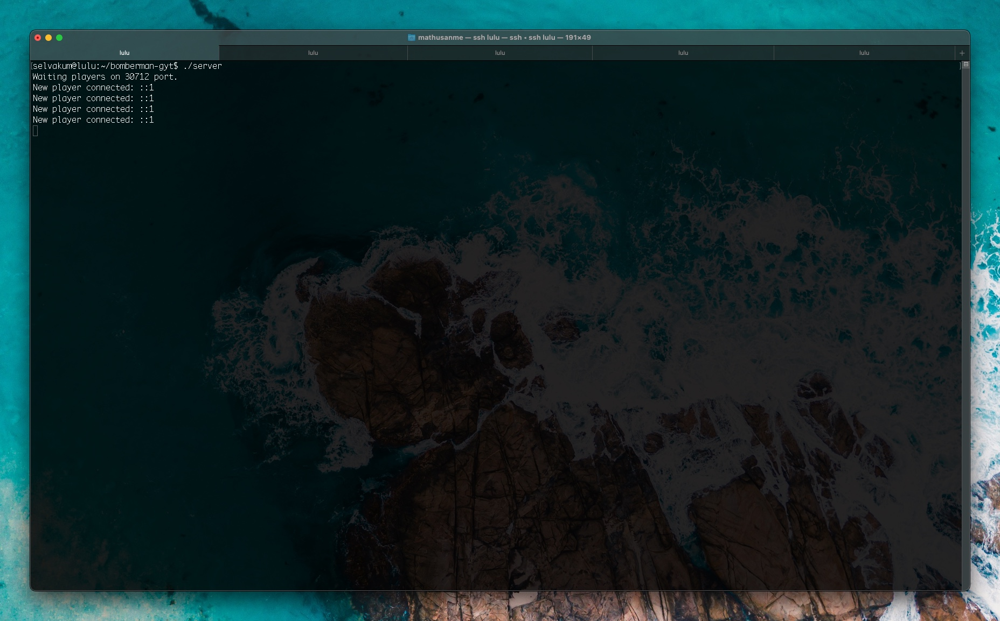
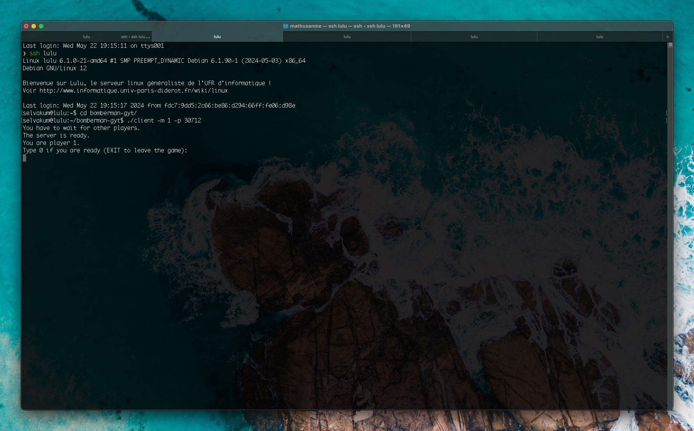
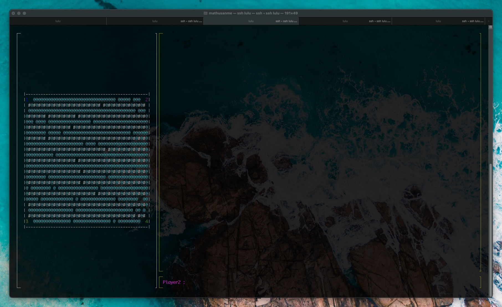
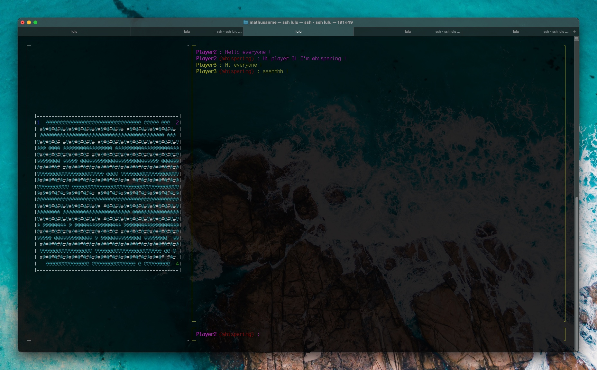
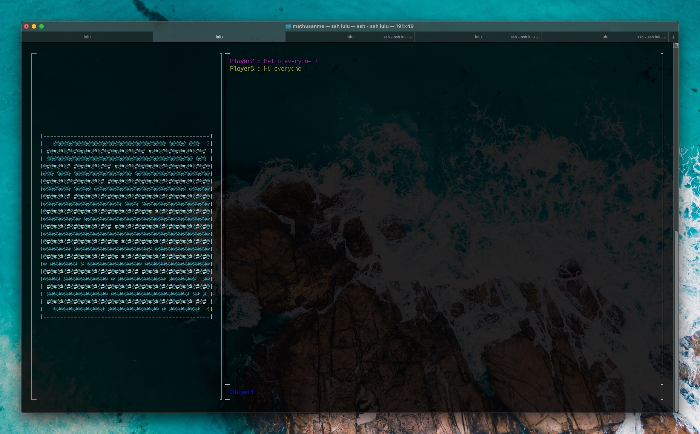
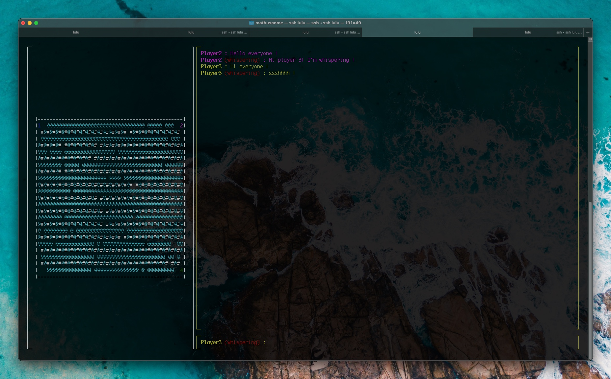
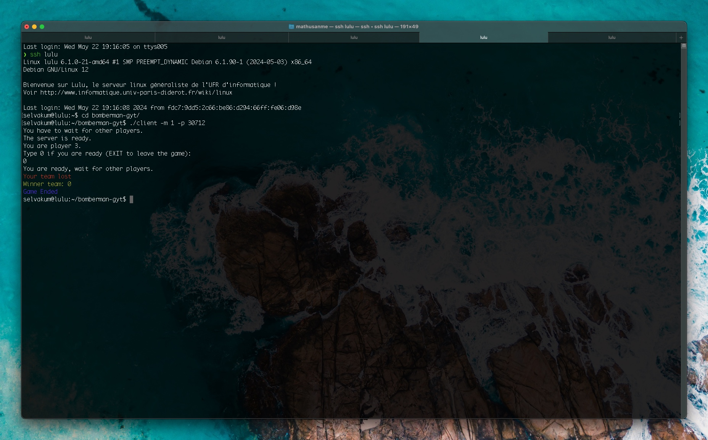
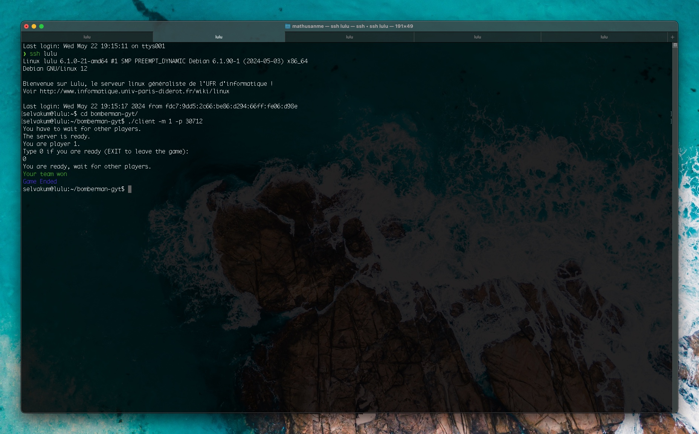

# C Network Bomberman

[](https://github.com/mathusanm6/C-Network-Bomberman/actions/workflows/build.yml) [](https://github.com/mathusanm6/C-Network-Bomberman/actions/workflows/format.yml) [](https://github.com/mathusanm6/C-Network-Bomberman/actions/workflows/test.yml)

## Description

As part of the **L3S6 course "Programmation Réseaux" (Network Programming)**, we were tasked with developing a network game in C. The aim of this project is to implement a server and a client for a network game of **Bomberman**. The server will be able to handle multiple clients, and the clients will be able to play the game in real-time. The user interface will be implemented using `ncurses`.

The project requirements are stated in the pdf file [sujet](sujet.pdf) (in French).

The project was developed within 8 weeks.

## Own contributions

- [x] Implemented the view for the game using `ncurses`.

- [x] Chat feature

  - [x] Implemented chat model
  - [x] Implemented chat communications through tcp sockets

- [x] End game feature

  - [x] Implemented end game communications through tcp sockets
  - [x] Implemented end game view

- [x] A lot of bug fixes :)

## Visuals

<table>
  <tr>
    <td align="center">
      <br>
      Setting up the server for the game.
    </td>
    <td align="center">
      <br>
      Players are ready to start.
    </td>
    <td align="center">
      <br>
      In-game action taking place.
    </td>
  </tr>
  <tr>
    <td align="center">
      <br>
      General in-game chat.
    </td>
    <td align="center">
      <br>
      Players discussing strategy.
    </td>
    <td align="center">
      <br>
      Players whispering in-game.
    </td>
  </tr>
  <tr>
    <td align="center">
      <br>
      Player has lost the game.
    </td>
    <td align="center">
      <br>
      Player has won the game.
    </td>
    <td align="center">
    </td>
  </tr>
</table>

## Demo

[Demo Video on Youtube](https://youtu.be/4hkg7EBgfLI)

## Installation

You will need the following dependencies:

- `gcc` compiler
- `make` build system
- `ncurses` library (for the user interface)

To install the project, run the following commands:

```bash
git clone git@github.com:mathusanm6/C-Network-Bomberman.git
cd bomberman-gyt
make
```

To compile just the server, run the following command:

```bash
make server
```

To compile just the client, run the following command:

```bash
make client
```

## Usage

To run the server, run the following command:

```bash
./server
```

To run the client, run the following command:

```bash
./client
```

The client program has some flags :

- `-p PORT` to connect the client to the server with the port `PORT`.
- `-m MODE` to choose the mode between `0` for `SOLO` and `1` for `TEAM`.

## Authors and acknowledgment

This project was developed by a group of students from Université Paris Cité, as part of the L3S6 course "Programmation Réseaux" (Network Programming). The group members are Gabin Dudillieu, Yago Iglesias Vázquez, and Mathusan Selvakumar.
